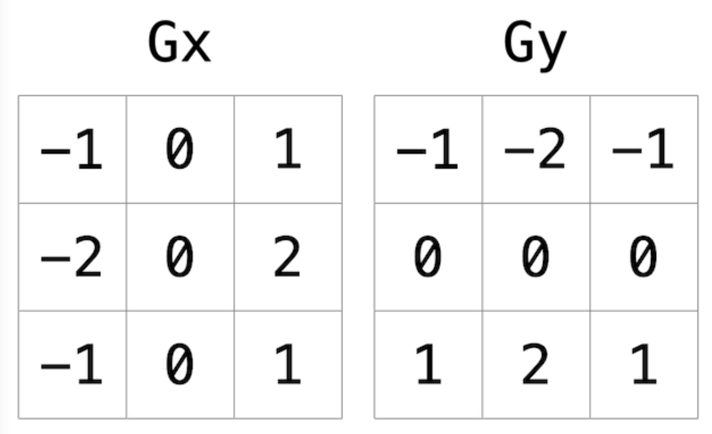

# README
  
*filter.c* transforms a 24-bit bitmap image by passing it through one of six filters and writing the filtered image to a new .bmp file. Original BMPs can be compressed or uncompressed but they must be 24-bit images. In each execution of the program you must choose one and only one of the six available filters. If you want to apply two filter transformations you must apply the first one in the first execution and then run the program again with a different flag on the transformed image. This will result in a total of two new BMP files, one for each transformation stage.

The six available filters are:

- **-g**  Make image grayscale
- **-h**  Reflect image horizontally
- **-v**  Reflect image vertically
- **-i**  Invert image colors
- **-b**  Blur image
- **-e**  Detect edges of objects in image

Two image directories are provided in the home directory: Original-Images to store unfiltered images and Filtered-Images to store your new transformations.

#### EXAMPLE INPUT

./filter -b ../Original-Images/tower.bmp ../Filtered-Images/newTower.bmp

#### EXPECTED OUTPUT

Your filtered image is ready to view!

_Navigate to Filtered-Images to see your transformed image._

## CODE WALKTHROUGH

**NOTE:** Make sure you navigate to the *Code* dir when executing filter.c.

Bitmap typedefs and struct definitions live in *bmp.h*. In general, included typedefs are aliases of primitive data types in C. *RGBTRIPLE* is a struct which defines an RGB color with 8 bits allotted to each channel.

Individual filter functions live in *helpers.c* and are referenced in *helpers.h*. All these files are linked via the included Makefile upon executing 'make ./filter'.

Four example images are included in the Original-Images directory but any 24-bit v4.0 BMPs can be used. If you run into "ERROR: Unsupported file format." refer to line 52 of *filter.c* for accepted parameters of BMPs.

*filter.c* begins by handling any errors that may occur when executing the function. These include entering a filter flag which does not exist, forgetting to enter a filter flag, and omitting an original image file or new file name.

The variables height and width are then defined, and memory is allocated for the image array. Each filter is then executed via the switch() function depending on which filter flag is passed to it. The new image file is then written to the location specified as the last argument of *filter.c*, and all memory is freed.

## IMAGE FILTERS

**grayscale()** iterates across each pixel in the original image and sets each pixel's RGB values to the average of the red, green, and blue values for that pixel.

**reflect_horz()** sets a temp image array that is initally the same as the image array. It iterates across each pixel of the original image one row at a time and places pixels from the right half of the image into its corresponding column on the left side. For example, the pixel in the first row and first column becomes the same pixel in the first row and last column.

It then uses the temp array to transfer the pixels from the left side of the image to the right, resulting in a new image reflected across the y-axis.

**reflect_vert()** behaves exactly as the previous function but with a transformation across the x-axis by manipulating pixels based on row (rather than column) positions.

**invert()** iterates across every pixel in the original image and inverts each pixel's color values by subtracting the current value from 255 (the maximum color brightness in 24-bit images) for each color channel.

**blur()** builds a 3 pixel by 3 pixel box around each pixel in the original image. For each color channel it averages the nine values of each pixel color in that box and saves it in a temp image array.

Images along the edges average the values for whichever pixels exist within the 3x3 structure. For example, the pixel in the top left of the image would be transformed by averaging each color channel value in the first three pixels of the first row and the first three pixels of the second row.

Once all of these averaged values are identified, they are moved from the temp array back into the original image array.

**edges()** is by far the most complex filter function in this group. It works similarly to **blur()** by identifying a 3 pixel by 3 pixel box around each pixel in the original image, but instead of merely averaging the color values for these pixels it uses the Sobel Operator to assign weighted values to each of them.

The weighted values are determined by multiplying each pixel's color channel value in the box by -2, -1, 0, 1, or 2 depending on its positioning. These values are then summed to get one value for each color channel. Since edges can appear in both vertical and horizontal directions, we need to account for two pixel boxes, Gx (horizontal) and Gy (vertical).

  

To find the actual blurred value for each color in a pixel, we take the square root of the pixel color's Gx^2 + Gy^2. The number is the rounded. A series of if-else statements then ascertains that no color value is above 255 (the maximum brightness value in 24-bit colors).

Finally, **edges()** places these new values into the original image array.
